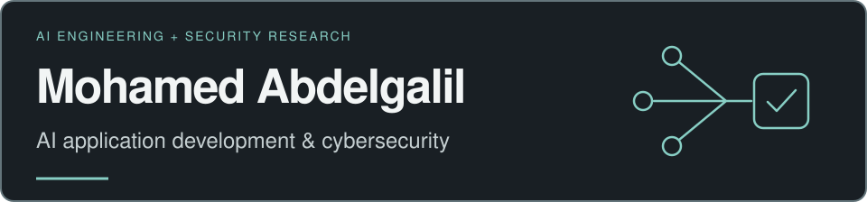
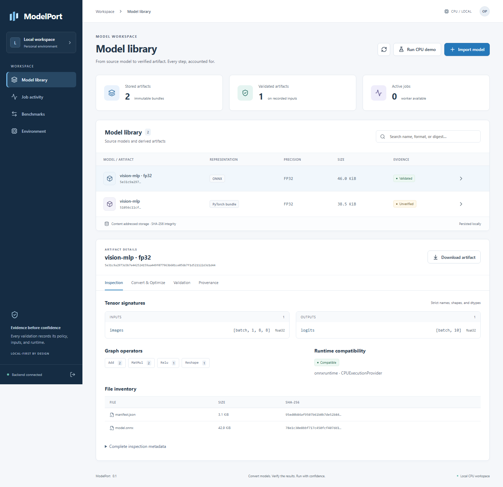
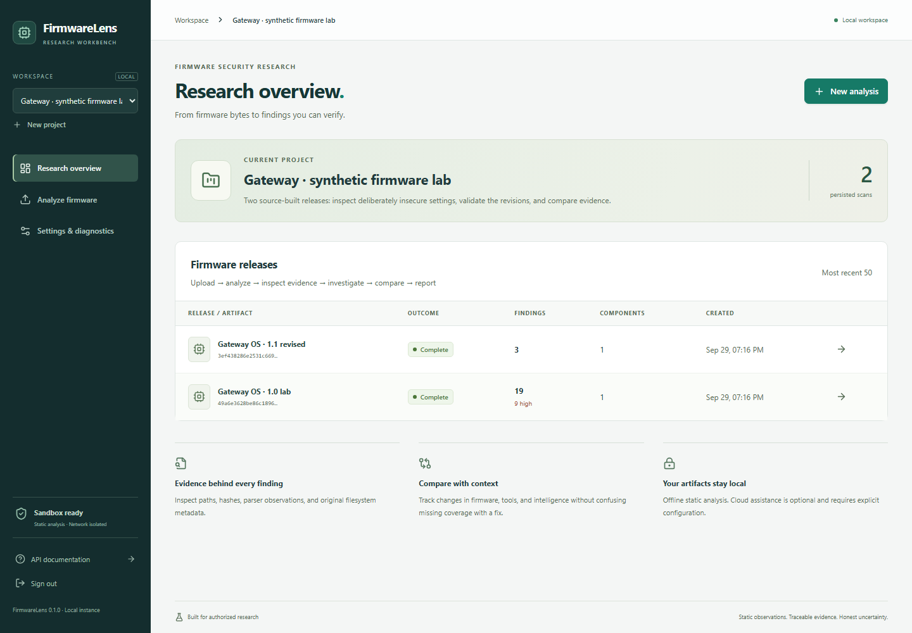

<picture>
  <source media="(max-width: 480px)" srcset="assets/header-mobile.svg">
  
</picture>

# Mohamed Abdelgalil

**AI application development & cybersecurity · Istanbul, Türkiye**

I build Python applications for working with AI models and investigating software security. My focus is on inspectable workflows: model conversion with numerical validation, firmware analysis with traceable evidence, and LLM integration with explicit boundaries.

**Explore:** [ModelPort](https://github.com/AlBrmagawi/modelport) · [FirmwareLens](https://github.com/AlBrmagawi/FirmLens)

**Connect:** [LinkedIn](https://www.linkedin.com/in/albrmagawi/)

## Selected work

### [ModelPort](https://github.com/AlBrmagawi/modelport)

**AI tooling · Original project · CPU beta**

A local workspace for engineers converting supported PyTorch models to ONNX. Compare source and converted outputs, measure CPU inference, and keep the artifacts and reports behind each result.

**Built with:** Python, PyTorch, ONNX Runtime, FastAPI, React, SQLite.

[Quickstart](https://github.com/AlBrmagawi/modelport#quickstart) · [Architecture](https://github.com/AlBrmagawi/modelport/blob/main/docs/architecture.md) · [Validation methodology](https://github.com/AlBrmagawi/modelport/blob/main/docs/validation.md)

View the ModelPort workspace

Existing repository capture of the local application. Numerical agreement on test inputs is distinct from task accuracy; performance depends on the model and hardware.

### [FirmwareLens](https://github.com/AlBrmagawi/FirmLens)

**Security tooling · Original project · Local research workbench**

A workbench for authorized Linux IoT firmware research. Inspect files and ELF hardening, generate SBOMs, review advisory matches and compare releases. Optional AI assistance works from a bounded evidence catalog.

**Built with:** Python, FastAPI, React, PostgreSQL, Docker, Syft, Grype.

[Quickstart](https://github.com/AlBrmagawi/FirmLens#quickstart) · [Architecture](https://github.com/AlBrmagawi/FirmLens/blob/main/docs/ARCHITECTURE.md) · [Research case study](https://github.com/AlBrmagawi/FirmLens/blob/main/docs/CASE_STUDY.md)

View the FirmwareLens workbench

Existing repository capture of the source-built synthetic demo. Advisory matches require investigation; they do not establish exploitability. AI is disabled by default.

### [DoS traffic classification](https://github.com/amerna-org/DOS-Detector-ML-KNN)

**Earlier ML study · Contribution under Amerna**

A Python notebook exploring K-nearest neighbors classification of TCP, UDP and HTTP flood records from CSV datasets. This is an offline study with reproducibility limitations, not a deployed intrusion detection system.

**Built with:** pandas, NumPy, scikit-learn, Matplotlib, Seaborn.

[Notebook](https://github.com/amerna-org/DOS-Detector-ML-KNN/blob/main/DOS_Attack_Types_ML_KNN.ipynb) · [My commits](https://github.com/amerna-org/DOS-Detector-ML-KNN/commits?author=AlBrmagawi)

## Technical strengths

- **AI applications:** Python, NLP, LLM integration, PyTorch / ONNX workflows and numerical validation.
- **Cybersecurity:** penetration testing, static firmware analysis, ELF inspection, SBOMs and evidence-based triage.
- **Engineering:** FastAPI, React / TypeScript, SQL, Docker, CLI design and automated checks.

## Credentials

Computer Engineering graduate, **Istanbul Kültür University**.

Certifications: **eJPT · eCPPT**.

## Contact

I'm interested in AI application development and cybersecurity opportunities, and collaborations on practical tools at their intersection.

[Connect on LinkedIn](https://www.linkedin.com/in/albrmagawi/) · [Explore my repositories](https://github.com/AlBrmagawi?tab=repositories)
